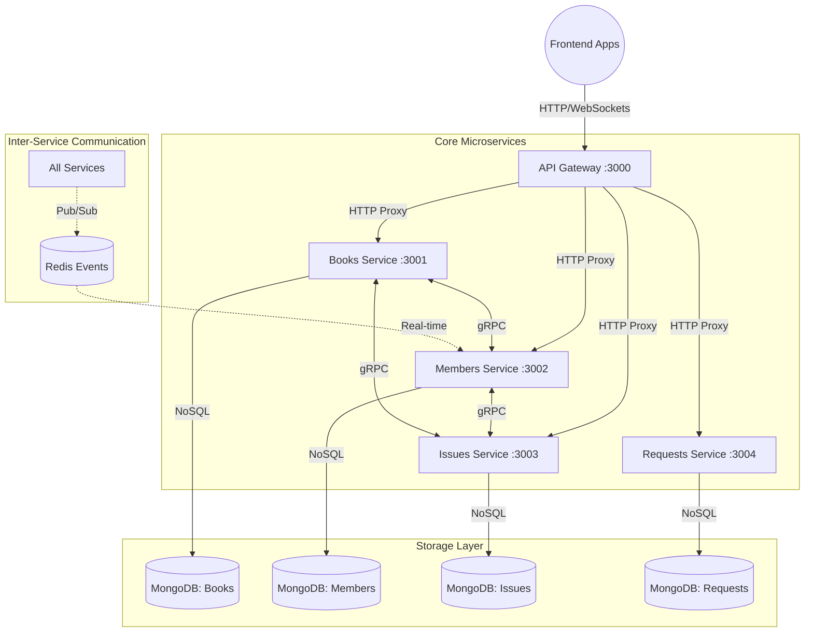

# 📚 Library Management System - Microservices Architecture

A high-performance, scalable microservices ecosystem built with **NestJS**, following a decentralized database-per-service pattern. This system manages library operations including book cataloging, member management, real-time notifications, and automated lending workflows.

## 🏗️ System Architecture



---

## 🛠️ Technology Stack

| Technology | Usage |
| :--- | :--- |
| **NestJS** | Primary Backend Framework (v10+) |
| **TypeScript** | Strongly typed development |
| **MongoDB** | Distributed Database (Mongoose ODM) |
| **gRPC** | High-performance Internal Service Communication |
| **Redis** | Event Bus (Pub/Sub) & WebSocket Adapter |
| **Docker** | Containerization & Orchestration |
| **Swagger** | Automated API Documentation |
| **Socket.io** | Real-time bi-directional communication |
| **RxJS** | Reactive programming for event streams |
| **Class Validator** | Decorator-based input validation |

---

## 📦 Microservices Detailed Breakdown

### 1. API Gateway (`api-gateway`)
*   **Role**: Unified entry point for all frontend applications.
*   **Technology**: `http-proxy-middleware`.
*   **Responsibilities**: Request routing, CORS management, and central logging.
*   **Port**: `3000`

### 2. Library Books Service (`library-books-service`)
*   **Role**: Management of the library's physical and digital assets.
*   **Responsibilities**: CRUD for books, category management, rack/shelf utilization, and book reviews.
*   **Port**: `3001` (HTTP) \| `5001` (gRPC)

### 3. Library Members Service (`library-members-service`)
*   **Role**: Identity and Access Management.
*   **Responsibilities**: Member/Staff profiles, role-based access, and the **Real-time Notification Engine** using WebSockets.
*   **Port**: `3002` (HTTP) \| `5002` (gRPC)

### 4. Library Issues Service (`library-issues-service`)
*   **Role**: Core Business Logic (Lending).
*   **Responsibilities**: Book check-outs, returns, fine calculation, and loan history.
*   **Port**: `3003` (HTTP) \| `5003` (gRPC)

### 5. Library Requests Service (`library-requests-service`)
*   **Role**: Workflow Management.
*   **Responsibilities**: Managing book acquisition requests from members and administrative approval flows.
*   **Port**: `3004` (HTTP) \| `5004` (gRPC)

---

## 🔄 Inter-Service Communication Patterns

### 🔹 Synchronous (gRPC)
Used for critical, immediate data dependencies between services. 
*   **Protocols**: Defined in `.proto` files within the `/proto` directory.
*   **Advantage**: Zero overhead compared to REST, strongly typed contracts.

### 🔹 Asynchronous (Redis Pub/Sub)
Used for non-blocking event-driven updates.
*   **Flow**: When a book is issued in `Issues Service`, an event is emitted. `Members Service` listens to this to trigger a real-time notification to the user's dashboard.

---

## 🚀 Getting Started

### 🐳 Docker Deployment (Recommended)
Launch the entire ecosystem with one command:
```bash
docker-compose up -d
```

### 👨‍💻 Local Development
1.  **Install Dependencies**:
    ```bash
    npm run install:all
    ```
2.  **Start Services**:
    ```bash
    npm run start:all
    ```

---

## 📑 API Documentation
Each service exposes its own Swagger documentation for developers:
*   Books: `http://localhost:3001/api/docs`
*   Members: `http://localhost:3002/api/docs`
*   Issues: `http://localhost:3003/api/docs`
*   Requests: `http://localhost:3004/api/docs`

---
*Developed as part of the Premium Library Management Suite.*
